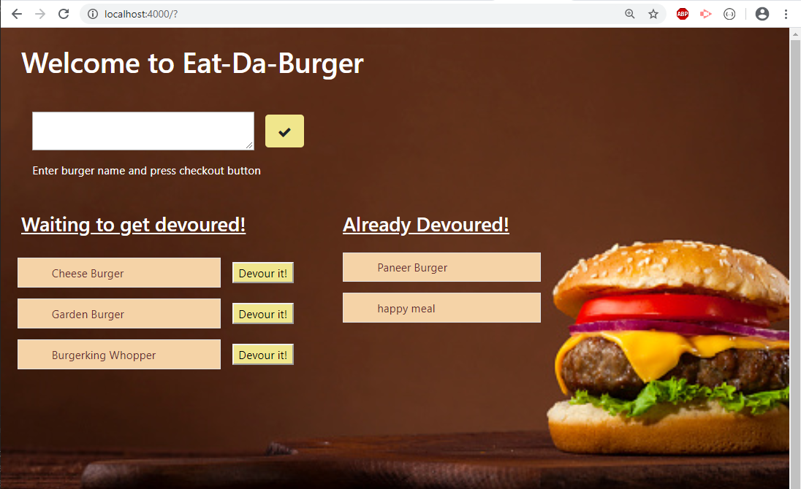

# Eat-Da-Burger

  
## Table of contents:

-   [ Description ](#description)
-   [ Installation ](#installation)
-   [ Deployed Link ](#deployed)
-   [ Usage ](#usage)
-   [ License ](#license)

## <a name="description"></a>Description:

'Eat-Da-Burger' is a restaurant app that lets users input the names of burgers they'd like to eat. Burger logger is created with MySQL, Node, Express, Handlebars and ORM. Each burger in the waiting area also has a 'Devour it!' button. When the user clicks it, the burger will move to the right side of the page indicating it is devoured!

## <a name="installation"></a>Installation:

```bash
    npm init
    npm i mysql dotenv
    npm i express express-handlebars
```
## <a name="deployed"></a>Deployed Link:

https://eat-th-burger.herokuapp.com/

## <a name="usage"></a>Usage:
```bash
    npm run start 
```


## <a name="contributing"></a>Contributing:
Pull requests are welcome. For major changes, please open an issue first to discuss what you would like to change.Code of Conduct: Standard (Fork, Clone, Commit, Push and Create Pull requests).

## <a name="license"></a>License:
 <i>MIT Copyright (c). All rights reserved.</i>

